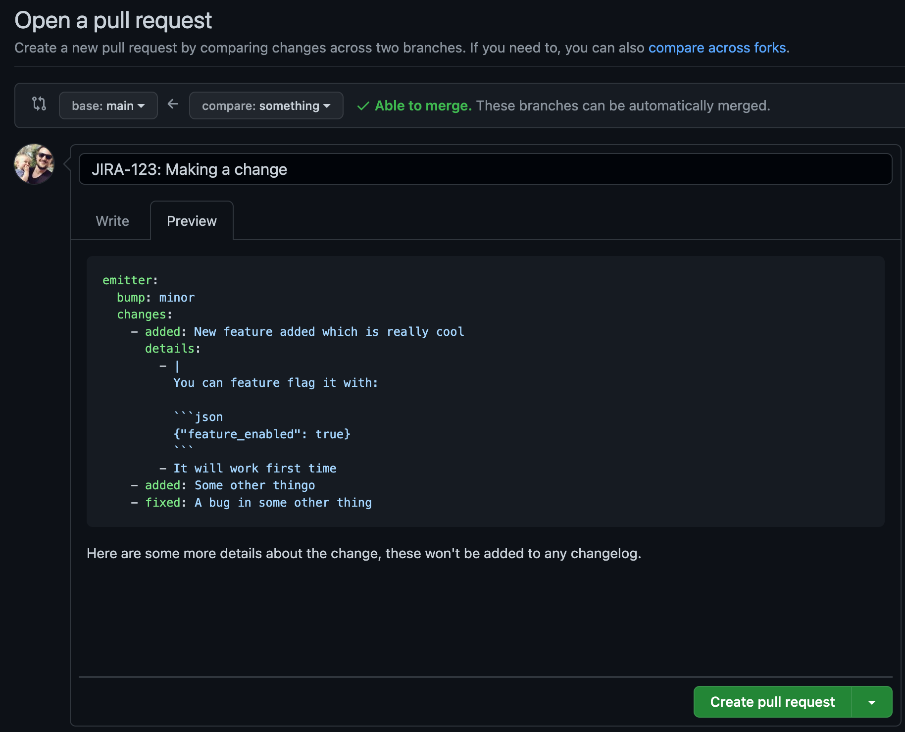
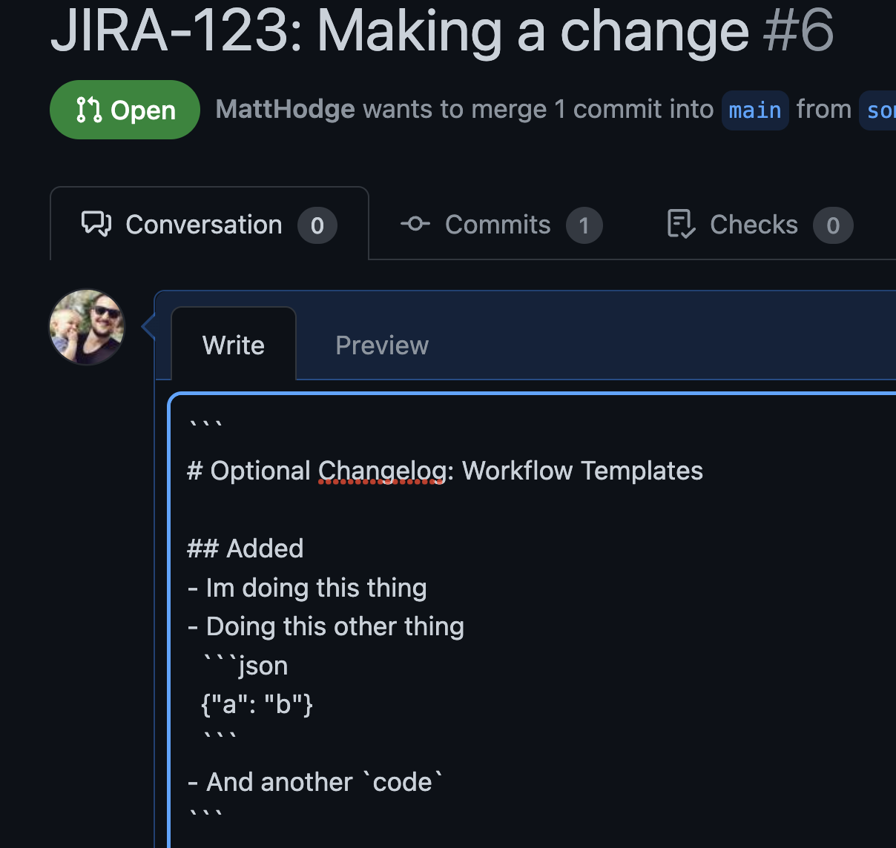
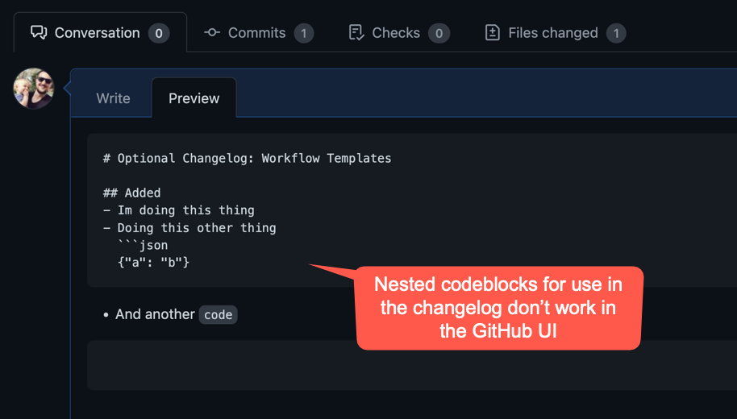

# PR Description To Changelog

- Uses a basic YAML definition inside a GitHub Pull Request to automatically generate a changelog from a pull request description
- First class support for versioning multiple packages in a single repo (monorepos)
- Changelogs are automatically generated and commited into your repository
- The ability to define custom changelog templates


## Who is this for?

Teams that:
- Want to [keep a changelog](https://keepachangelog.com/) but not have to do it manually
- Are practicing trunk based development
- Who want to use [SemVer](https://semver.org/)

## What is this trying to solve?

Here is a list of some of the annoying problems this project aims to solve. These often appear when you have a few people commiting to a monorepo:

- **Merge conflicts in the changelog**:
  - Person A and Person B open a new branch each. They both work on a feature and update a changelog by hand. Person A merges first, Now Person B gets a merge conflict on the changelog and has to fix it before they can merge.
- **Needing to manually bump a version**:
  - Especially in a monorepo with multiple technologies, where version files are specified or used can differ, increasing the friction commiting
- **Avoiding commit naming standards such as [Conventional Commits](https://www.conventionalcommits.org/en/v1.0.0/)**:
  - Getting a whole team to switch to commiting using a naming standard is difficult
  - Tools exist to assist, such as [Commitizen](https://commitizen-tools.github.io/commitizen/), but its a challenge forcing everyone to use tooling, especially if they do their commits from GUI's such as VSCode
- **Tooling that just doesn't work in a monorepo**:
  - There are tools that handle auto version bumping like [auto](https://intuit.github.io/auto/) or [semantic-release](https://github.com/semantic-release/semantic-release) but they either don't support mono repos or [operating them in monorepos is a challenge](https://dev.to/antongolub/the-chronicles-of-semantic-release-and-monorepos-5cfc)
- **Support for SemVer**:
  - When using monorepo world, tooling like [Bazel](https://bazel.build/) assists by knowing what to test based on what files have changed. This allows sweeping code refactors and little care about backwards compatibility.
  - Unfortunately for infrastructure monorepos (eg. Terraform, Helm, Docker Images), testing is more difficult so you tend to version things like Terraform Modules with Semver, allowing people to pin to specific versions. Additionally, some tools like Helm *require* the use of Semver.
  - This tool supports the infrastructure monorepo use case by helping you maintain a changelog and perform versioning using SemVer, without the friction of doing so

## How It Works

- On a PR, the commit author adds the following front matter to the PR:

  <details><summary>Example front matter</summary>

  ```yaml
  emitter:
    bump: minor
    changes:
      - added: New feature added which is really cool
        details:
          - |
            You can feature flag it with:

            ```json
            {"feature_enabled": true}
            ```
          - It will work first time
      - added: Some other thingo
      - fixed: A bug in some other thing
  ```

  Here are some more details about the change, these won't be added to any changelog.
  </details>

- The following bump types are supported (from [Semver.org](https://semver.org/)):
  - `major` when you make incompatible API changes
  - `minor` when you add functionality in a backwards compatible manner
  - `patch` when you make backwards compatible bug fixes

- The following change types are supported (from [Keep a Changelog](https://keepachangelog.com/en/1.0.0/)):
  - `added` for new features.
  - `changed` for changes in existing functionality.
  - `deprecated` for soon-to-be removed features.
  - `removed` for now removed features.
  - `fixed` for any bug fixes.
  - `security` in case of vulnerabilities.


- Additional details are supported by using `details` with list of more details about a change. These will be added to the changelogs via indented bullet points.



- Once the PR is merged, a changelog will be generated in this format [example-emitter-changelog.md](example-emitter-changelog.md)
- If operating in a monorepo, you simply add additional changes to the front matter

  <details><summary>Example change across multiple components in a monorepo</summary>

  ```yaml
  emitter:
    bump: patch
    changes:
      - fixed: Tweak message format to increase message performance
  intake:
    bump: patch
    changes:
      - fixed: Accept new message format to increase message performance
  ```

  Here are some more details about the change, these won't be added to any change log.
  </details>

# FAQ

## Why YAML to define the changelog?

A structured data format makes it much easier to parse as well as use values in the changelog template.

The use of markdown was considered, but it's not possible to embed additional nested information, take this example:




## Configuration

### Defining components

Modify the `config.yaml` to define a mapping between components and and their changelogs.

Multiple can be listed to support monorepos

```yaml
master_branch_name: master
components:
  emitter:
    changelog_output_file: CHANGELOG-emitter.md # in repo root
    version_output_file: VERSION-emitter.txt
    # Example value: 1.0.0-prerelease+2022.10.12.413.sha.40bcaac
    pre_release_version_template: "$CURENT_VERSION-prerelease+%Y.%m.%d.$MINUTES_TODAY.sha.$GITSHA"
  intake:
    changelog_output_file: CHANGELOG-intake.md # in repo root
    version_output_file: VERSION-intake.txt
    # Example value: 1.0.0-prerelease+2022.10.12.413.sha.40bcaac
    pre_release_version_template: "$CURENT_VERSION-prerelease+%Y.%m.%d.$MINUTES_TODAY.sha.$GITSHA"
```

### Available Pre Release Templated Values

- [Python strftime() and strptime() format codes](https://docs.python.org/3/library/datetime.html#strftime-and-strptime-format-codes) - eg `%Y` for 2022
- `$CURRENT_VERSION` - The current version of the component from the main branch
- `$MINUTES_TODAY` - How many minutes have occurred so far today. Useful for date base ordering of pre-releases
- `$GIT_SHA` - Short git sha of the current branch

## Inspiration
- https://pypi.org/project/calver/
- https://github.com/python-semver/python-semver
- https://gitmoji.dev/
- https://commitizen-tools.github.io/commitizen/
- https://github.com/intuit/auto
